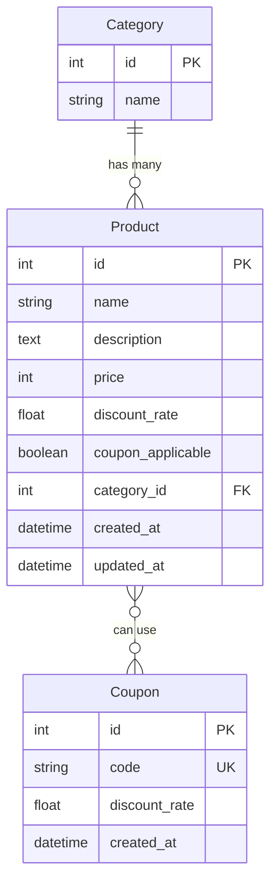

# Shop Management Service

## 프로젝트 개요

쇼핑몰의 상품을 관리하기 위한 RESTful API 서비스입니다. 이 서비스는 다음과 같은 주요 기능을 제공합니다.

- 전체 상품 리스트 조회 및 카테고리별 필터링
- 상품 상세 정보 조회 (할인율 적용된 가격 포함)
- 쿠폰 적용 및 최종 가격 계산

## API 엔드포인트 목록
| 메소드 | 엔드포인트           | 설명                           |
|------|-------------------|-------------------------------|
| GET  | /api/categories   | 카테고리 목록을 조회합니다           |
| GET  | /api/coupons      | 쿠폰 목록을 조회합니다              |
| GET  | /api/products     | 상품 목록을 조회합니다              |
| GET  | /api/products/{id}| 상품 상세 정보를 조회합니다          |

> Note: 서버 실행 시 시드 데이터가 일괄 생성됩니다.

## 기술 스택

- 언어: Python 3.9
- 프레임워크: Django 3.0.11, Django REST Framework (DRF)
- 데이터베이스: MySQL 8.0
- 패키지 관리: Poetry
- API 문서화: DRF Spectacular
- 필터링: Django Filter


## 실행 방법

Docker 및 Docker Compose가 설치되어 있어야 합니다.

```bash
cp .env.example .env  # 환경 변수 파일 생성 및 필요시 수정

# 개발 환경 시작 (빌드 + 실행 + 로그 확인)
make dev
```

### 테스트 실행

```bash
make test
```

### API 문서

서버 실행 후 아래 다음 URL에서 Swagger UI를 통해 API 문서를 확인할 수 있습니다.
- http://localhost:8000/swagger

## 디렉토리 구조
```
shop-management-service/
├── config/                      # 프로젝트 설정
└── api/
    ├── __init__.py
    ├── asgi.py
    ├── urls.py                   # 메인 URL 라우팅
    ├── wsgi.py
    └── products/                 # 상품 관리 앱
        ├── __init__.py
        ├── apps.py
        ├── models.py             # 상품, 카테고리, 쿠폰 모델
        ├── serializers.py        # DRF 시리얼라이저
        ├── urls.py               # 상품 API 경로
        ├── views.py              # API 뷰
        └── tests.py              # 테스트 코드
```

## 데이터베이스 설계
